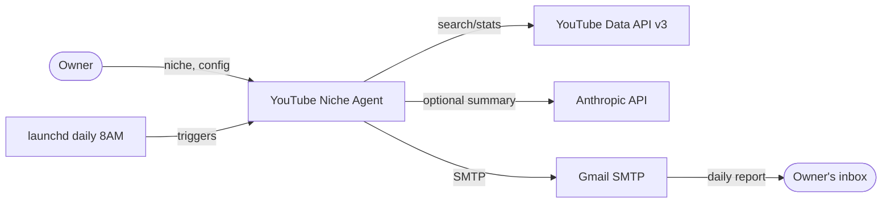
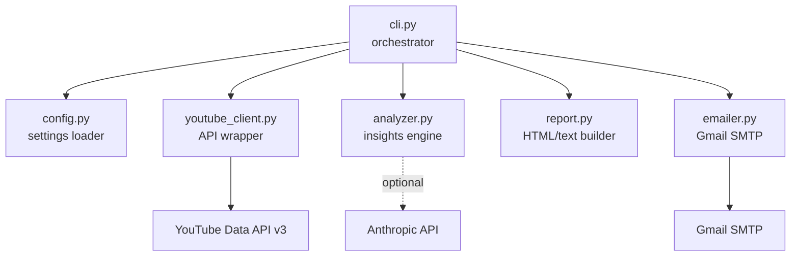
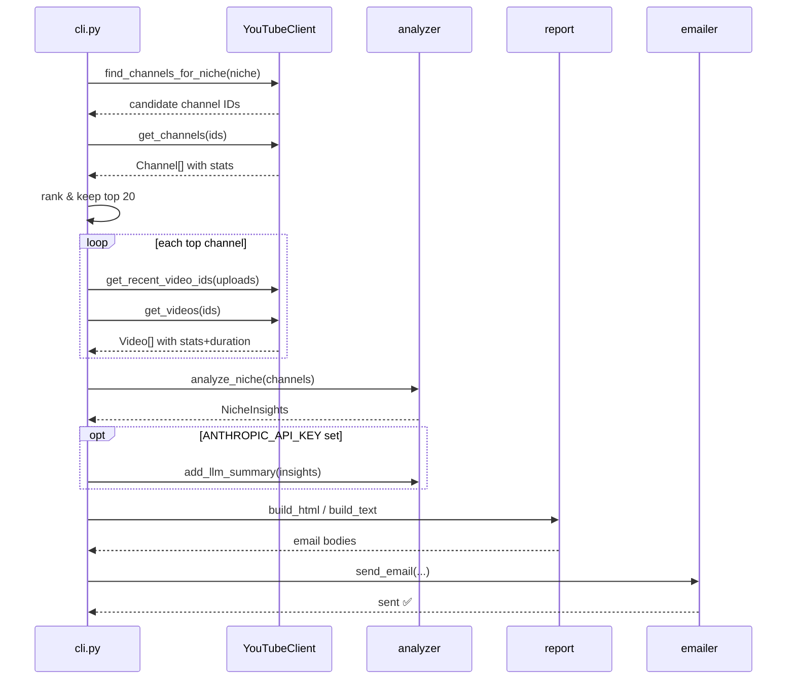
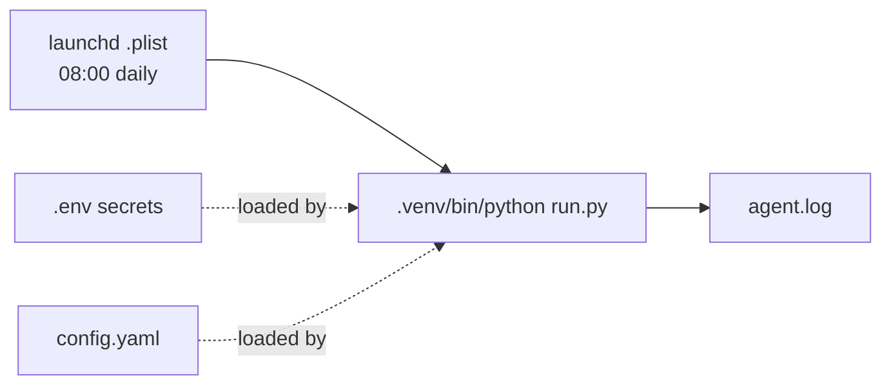

# High-Level Design (HLD) — YouTube Niche Agent

## 1. Purpose

An automated agent that, for a given **niche**, discovers the **top 20 Indian
YouTube creators**, analyzes their **Shorts and long-form** content (topics,
hooks, engagement), infers **why the top videos perform**, and **emails a daily
report** to the owner.

## 2. Goals & Non-Goals

| | |
|---|---|
| **Goals** | Discover top creators per niche; quantify engagement; detect title hooks & topic themes; compare Shorts vs long-form; deliver a readable daily email; run unattended on a schedule. |
| **Non-Goals** | Real-time monitoring; shares/saves (not exposed by the API); paid analytics; a web UI; multi-tenant/hosted service; storing historical time-series. |

## 3. System Context

The agent is a **single-process Python batch job**. It has no persistent server;
it wakes on a schedule, does its work, sends an email, and exits.

## 4. Component Overview

| Component | Responsibility |
|---|---|
| `config.py` | Load `.env` + `config.yaml`, validate prerequisites. |
| `youtube_client.py` | Quota-aware wrapper over YouTube Data API; returns typed `Channel`/`Video`. |
| `analyzer.py` | Compute engagement, detect hooks/topics, compare Shorts vs long, optional LLM summary. |
| `report.py` | Render insights into HTML + plaintext email bodies. |
| `emailer.py` | Send multipart email via Gmail SMTP over SSL. |
| `cli.py` | Orchestrate the pipeline, handle args & error paths. |

## 5. End-to-End Data Flow

## 6. Key Design Decisions

| Decision | Rationale |
|---|---|
| **Search videos, not channels, to find creators** | Surfaces creators *currently active & relevant* to the niche; ranks the resulting pool by subscribers/views. |
| **Heuristics first, LLM optional** | The daily cron runs without Claude by default → free, deterministic, no external cost. LLM adds qualitative depth only when a key is present. |
| **Graceful degradation** | Per-niche failures are caught and logged; the run still emails whatever succeeded. LLM/email issues never crash analysis. |
| **Engagement = (likes+comments)/views** | Shares/saves aren't in the public API; the report states this explicitly rather than faking numbers. |
| **Stateless batch job** | Simplest thing that meets a "daily email" requirement; no DB or server to maintain. |
| **launchd over cron** | Native macOS scheduler; survives reboots; catches up on wake. |

## 7. External Dependencies

| Dependency | Use | Quota / Cost |
|---|---|---|
| YouTube Data API v3 | discovery + stats | 10,000 units/day free; one niche ≈ few hundred units |
| Gmail SMTP | delivery | Free; requires app password + 2FA |
| Anthropic API (optional) | qualitative summary | Pay-per-use; only if key set |
| `google-api-python-client`, `PyYAML`, `Jinja2`, `python-dotenv`, `anthropic` | libraries | — |

## 8. Deployment & Scheduling

- Runs from a local **Python venv** on the owner's Mac.
- `com.youtubeagent.daily.plist` (a launchd agent) triggers `run.py` at 08:00 daily.
- Secrets live in a local, gitignored `.env`; config in `config.yaml`.
- Logs append to `agent.log`.

## 9. Non-Functional Characteristics

- **Reliability:** per-niche try/except; optional features never block the core.
- **Cost control:** heuristic default = $0 marginal cost; quota-batched API calls.
- **Security:** secrets only in `.env` (gitignored); app password, not account password; no secrets in the repo.
- **Observability:** timestamped stdout logging → `agent.log`.
- **Portability:** pure Python; only the plist paths are machine-specific.

## 10. Known Limitations & Future Work

- launchd runs only while the Mac is awake → move to a cloud host for guaranteed delivery.
- No historical trend tracking → add a datastore (SQLite) to track week-over-week movement.
- Hook detection is title-only → add transcript/first-3-seconds analysis for real "hook" quality.
- Shares/saves unavailable → integrate an owner's YouTube Studio export or a paid API if needed.
