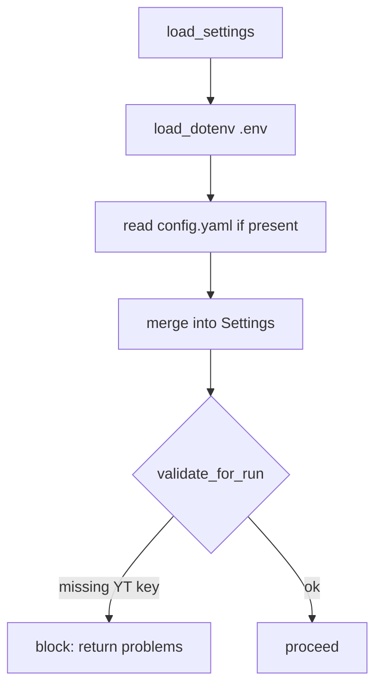
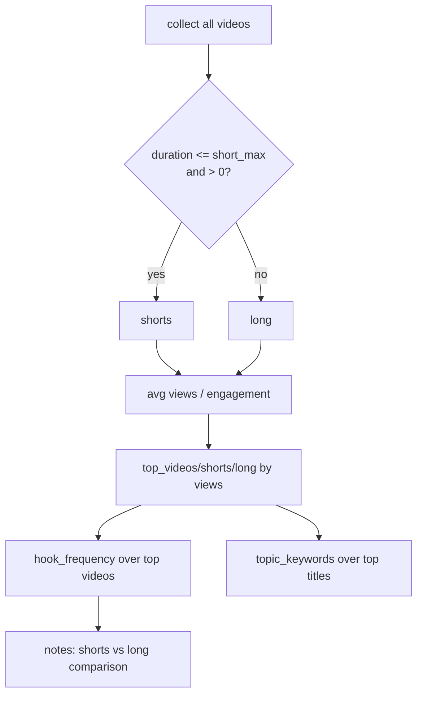
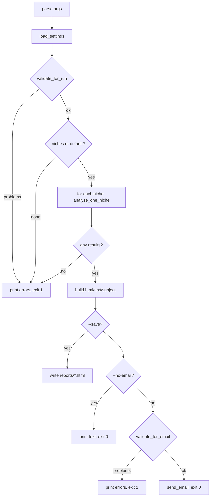

# Low-Level Design (LLD) — YouTube Niche Agent

Detailed design of modules, data structures, algorithms, and control flow.
File references point to the actual implementation.

---

## 1. Module Map

```
run.py                      → youtube_agent.cli:main
youtube_agent/
  config.py                 → Settings, load_settings, validate_*
  youtube_client.py         → YouTubeClient, Channel, Video, parse_iso8601_duration
  analyzer.py               → NicheInsights, analyze_niche, detect_hooks, add_llm_summary
  report.py                 → build_html, build_text, subject_line
  emailer.py                → send_email
  cli.py                    → main, analyze_one_niche
```

---

## 2. Data Structures

### 2.1 `Settings` (config.py)

Frozen-ish dataclass holding merged `.env` + `config.yaml` values.

| Field | Type | Source | Default |
|---|---|---|---|
| `youtube_api_key` | str | env | — |
| `gmail_address` | str | env | — |
| `gmail_app_password` | str | env | — |
| `report_to` | str | env (falls back to `gmail_address`) | — |
| `anthropic_api_key` | str | env | "" |
| `default_niches` | list[str] | yaml | [] |
| `region_code` | str | yaml | "IN" |
| `relevance_language` | str | yaml | "hi" |
| `top_n_creators` | int | yaml | 20 |
| `videos_per_creator` | int | yaml | 25 |
| `short_max_seconds` | int | yaml | 60 |
| `rank_by` | str | yaml | "subscribers" |

- **Property** `use_llm -> bool`: `True` iff `anthropic_api_key` is non-empty.

### 2.2 `Video` (youtube_client.py)

```python
@dataclass
class Video:
    video_id, title, description, published_at: str
    duration_seconds, views, likes, comments: int
    tags: list[str]
```

| Member | Kind | Definition |
|---|---|---|
| `is_short` | property | `duration_seconds <= 60` (report uses configured threshold instead) |
| `url` | property | `https://www.youtube.com/watch?v={id}` |
| `engagement_rate` | property | `(likes + comments) / views`, or `0.0` if `views <= 0` |

### 2.3 `Channel` (youtube_client.py)

```python
@dataclass
class Channel:
    channel_id, title: str
    subscribers, total_views, video_count: int
    uploads_playlist: str
    videos: list[Video]
```

- `url` property → `.../channel/{id}`.

### 2.4 `NicheInsights` (analyzer.py)

Aggregated output for one niche:

| Field | Meaning |
|---|---|
| `niche`, `channels`, `total_creators` | inputs / count |
| `shorts_avg_views`, `long_avg_views` | mean views by format |
| `shorts_avg_engagement`, `long_avg_engagement` | mean engagement by format |
| `top_videos`, `top_shorts`, `top_long` | ranked lists by views |
| `hook_frequency` | `list[(hook_name, count)]` over top videos |
| `topic_keywords` | `list[(word, count)]` from top titles |
| `llm_summary` | optional Claude text |
| `notes` | human-readable observations/warnings |

---

## 3. Configuration Loading (config.py)



- `load_settings(config_path=None)`: loads `.env` from repo root, parses YAML
  (empty/missing → `{}`), constructs `Settings`. `report_to` defaults to
  `gmail_address` when blank.
- `validate_for_run(settings)`: returns list of blockers — currently requires
  `youtube_api_key`.
- `validate_for_email(settings)`: requires `gmail_address` + `gmail_app_password`.
- `ROOT`: repo root path used to locate `.env`, `config.yaml`, `reports/`.

---

## 4. YouTube API Layer (youtube_client.py)

### 4.1 `parse_iso8601_duration(value) -> int`

Regex `P(nD)?T(nH)?(nM)?(nS)?` → total seconds.

| Input | Output |
|---|---|
| `PT58S` | 58 |
| `PT1M35S` | 95 |
| `PT1H2M3S` | 3723 |
| `""` / malformed | 0 |

### 4.2 `YouTubeClient` methods & quota cost

| Method | API call | Cost | Notes |
|---|---|---|---|
| `find_channels_for_niche(niche, region, lang, pool_size)` | `search.list` (type=video, order=viewCount) | 100/page | Paginates until `pool_size` unique channel IDs collected; dedups via a `seen` set. |
| `get_channels(ids)` | `channels.list` | 1/50 ids | Batches >50; reads snippet/statistics/contentDetails (uploads playlist). |
| `get_recent_video_ids(uploads, limit)` | `playlistItems.list` | 1/page | Paginates to `limit`; returns newest uploads. |
| `get_videos(ids)` | `videos.list` | 1/50 ids | Batches; parses duration, view/like/comment counts, tags. |

- `_to_int(value)`: defensive cast; API returns counts as strings and may omit
  fields (e.g. hidden like counts) → defaults to `0`.
- **Design choice:** searching *videos* then collecting `snippet.channelId`
  yields creators currently ranking for the niche; ranking is done later by the
  caller, not by search order.

### 4.3 One-niche quota estimate

```
search:        ~1–2 pages   → 100–200 units
channels.list: 60 ids       → 2 units
per creator:   playlistItems(1) + videos.list(1) × 20 → ~40 units
TOTAL ≈ 150–250 units  (budget 10,000/day)
```

---

## 5. Analysis Engine (analyzer.py)

### 5.1 Hook detection — `detect_hooks(title) -> list[str]`

Applies 8 regex patterns to the title; returns the names that match.

| Hook | Matches (examples) |
|---|---|
| number/listicle | any digit |
| question | `?`, leading how/why/what/which/kya/kaise/kyun |
| curiosity/reveal | secret, truth, revealed, exposed, nobody, hidden, sach, raaz |
| superlative | best, worst, biggest, first, only, ever, cheapest, fastest |
| urgency/news | now, today, breaking, new, 2024–2026, before |
| personal/story | i, my, we, meri, mera, hum, main |
| emotional | amazing, shocking, emotional, regret, mistake, warning |
| how-to/tutorial | how to, tutorial, guide, tips, tricks, explained, seekho |

Patterns are Hindi/Hinglish-aware for the Indian audience.

### 5.2 `analyze_niche(niche, channels, short_max_seconds) -> NicheInsights`



- **Splitting:** a video with `0 < duration <= short_max_seconds` is a Short;
  everything else is long-form. (Zero-duration = unknown → treated as long.)
- **Averages:** `_avg([...])` guards empty lists → `0.0`.
- **Top lists:** sorted by `views` desc — top 15 overall, top 10 each format.
- **Hook frequency:** `Counter` over hooks of top videos; a hook appearing on
  more high-view titles ranks higher → a proxy for "what's working."
- **Topic keywords:** `_keywords(text)` tokenizes latin+Devanagari, drops
  stopwords (English + Hindi) and tokens ≤ 2 chars; `Counter.most_common(20)`.
- **Notes:** compares Shorts vs long avg views & engagement into plain-English
  observations.

### 5.3 `add_llm_summary(insights, api_key)` — optional

- Imports `anthropic` lazily; if missing → adds a note, returns (no crash).
- Builds a prompt from the top-15 titles + view counts.
- Model: `claude-sonnet-5`, `max_tokens=700`.
- Extracts text blocks into `insights.llm_summary`.
- **Any exception** (network, auth, rate limit) is caught → recorded in `notes`;
  never breaks the run. This is deliberate for an unattended cron job.

---

## 6. Report Rendering (report.py)

- **Jinja2 `Environment`** with `autoescape=True` (safe against odd titles).
- **Custom filters (registered before template compile):**
  - `fmt`: Indian number formatting — `Cr` (crore ≥ 1e7), `L` (lakh ≥ 1e5), `K`.
  - `hooks`: title → comma-joined hook names (or `—`).
- `build_html(niches)`: one card per niche — stats table, hook chips, topic
  keywords, top long-form, top Shorts, optional AI summary, notes, and a footer
  disclaiming shares/saves.
- `build_text(niches)`: plaintext fallback for the multipart email.
- `subject_line(niches)`: `📺 YouTube Report — {niches} — {DD Mon YYYY}`.

> **Ordering constraint (guards a real bug):** custom filters must be registered
> **before** `_ENV.from_string(...)` compiles the template, because Jinja
> validates filter names at compile time. This is why filter definitions sit
> above the template literal in the file.

---

## 7. Email Delivery (emailer.py)

`send_email(*, from_addr, app_password, to_addr, subject, html_body, text_body)`

- Builds a `MIMEMultipart("alternative")` with plaintext + HTML parts (clients
  prefer HTML, fall back to text).
- Connects via `smtplib.SMTP_SSL("smtp.gmail.com", 465)`, logs in with the app
  password, sends, and closes (context manager).
- No ret/ry logic — a failed send surfaces as an exception the CLI reports.

---

## 8. Orchestration (cli.py)

### 8.1 CLI arguments

| Arg | Effect |
|---|---|
| `niches...` | zero or more niches; empty → `config.default_niches` |
| `--no-email` | print the text report to stdout instead of sending |
| `--save` | also write `reports/report-YYYYMMDD-HHMM.html` |

### 8.2 `main(argv)` control flow



### 8.3 `analyze_one_niche(client, settings, niche)`

1. `find_channels_for_niche` with `pool_size = max(top_n*3, 40)` (over-fetch so
   ranking has choices).
2. `get_channels` → sort by `subscribers` or `total_views` (per `rank_by`) desc.
3. Keep `top_n_creators`.
4. For each: `get_recent_video_ids` → `get_videos`, attach to `channel.videos`.
5. `analyze_niche(...)`; if `settings.use_llm`, `add_llm_summary(...)`.
6. Return `NicheInsights`.

- **Failure isolation:** in `main`, each niche is wrapped in try/except; a
  failing niche is logged and skipped, others still produce a report.
- **Logging:** `_log()` prints `[HH:MM:SS] message`, flushed → tails cleanly in
  `agent.log`.

### 8.4 Exit codes

| Code | Meaning |
|---|---|
| 0 | report sent (or printed with `--no-email`) |
| 1 | blocked: missing YT key, no niche, no results, or missing email creds |

---

## 9. Error Handling Summary

| Failure | Handling |
|---|---|
| Missing YouTube key | `validate_for_run` → exit 1 before any API call |
| One niche errors | caught per-niche, logged, skipped |
| `anthropic` not installed / API error | note added, run continues |
| Missing email creds | report built; send blocked with clear error (exit 1) |
| Hidden like/comment counts | `_to_int` → 0, engagement degrades gracefully |
| Malformed duration | `parse_iso8601_duration` → 0 (treated as long-form) |

---

## 10. Extension Points

- **New hook patterns:** add to `_HOOK_PATTERNS` in analyzer.py.
- **Different ranking:** extend `rank_by` handling in `analyze_one_niche`.
- **Historical trends:** persist `NicheInsights` to SQLite keyed by date.
- **Transcript hooks:** add a fetcher and feed first-N-seconds text to `detect_hooks`/LLM.
- **Other email providers:** swap `emailer.send_email` for an API client (SendGrid/Resend).
- **Config-per-niche tuning:** promote `short_max_seconds`, `videos_per_creator`
  to per-niche overrides in `config.yaml`.
